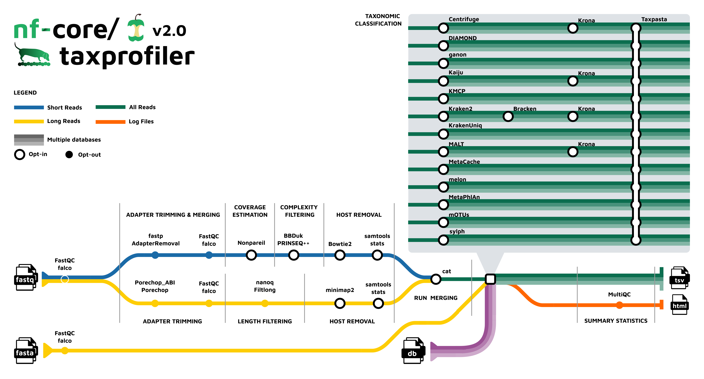

# nf-core/taxprofiler

En esta segunda parte ejecutaremos `nf-core/taxprofiler` usando lecturas metagenómicas que ya pasaron por pasos previos de control de calidad y remoción de hospedero. Por esta razón, en esta práctica **no realizaremos trimming, filtrado de calidad ni remoción de host dentro de taxprofiler**.

El objetivo de esta sección es clasificar taxonómicamente las lecturas usando:

- **Kraken2**, para clasificación taxonómica.
- **Bracken**, para estimación de abundancias taxonómicas.
- **Krona**, para visualización interactiva de resultados.
- **Taxpasta**, para estandarizar y enriquecer las tablas taxonómicas.

---
El flujode trabajo que seguiremos es el siguiente: 

<p align="center">
  
</p>

<p align="center">
  <b>Figura 1.</b> Flujo general de clasificación taxonómica <code>nf-core/taxprofiler</code>.
</p>


## 1. Crear la carpeta de trabajo para taxprofiler

Primero, ubíquese en su carpeta personal del curso:

```bash
cd /hpcfs/home/cursos/metagenomica_moderna/estudiantes/Carpeta_estudiante/Taller5
```

Recuerde reemplazar `Carpeta_estudiante` por el nombre real de su carpeta.

Cree la carpeta principal para este análisis:

```bash
mkdir Taxprofiler
```

Ingrese a la carpeta:

```bash
cd Taxprofiler
```

Dentro de `Taxprofiler`, cree dos carpetas:

```bash
mkdir Archivos
mkdir Secuencias
```

La estructura esperada será:

```text
Taller5/
└── Taxprofiler/
    ├── Archivos/
    └── Secuencias/
```

---

## 2. Identificar las secuencias asignadas

Cada estudiante trabajará con dos muestras. La siguiente tabla indica las muestras asignadas:

| Estudiante | Muestra 1 | Muestra 2 |
|---|---|---|
| Rodriguez Alvarado, Lina Daniela | SRR17048924 | SRR17048974 |
| Agudelo, Sergio | SRR17049011 | SRR17049018 |
| Bernal Zarate, María Paula | SRR17048933 | SRR17048978 |
| Bonilla Torres, Rafaela | SRR17048983 | SRR17048902 |
| Diaz Ramirez, Maria Ximena | SRR17048994 | SRR17049021 |
| Duarte Romero, Yeimi Valentina | SRR17048995 | SRR17048980 |
| Floréz Gamba, Diana Carolina | SRR17048895 | SRR17048957 |
| García Catiblanco, Sebastián | SRR17048990 | SRR17049013 |
| Huerfano Santos, Lina Paola | SRR17048922 | SRR17048973 |
| León Jiménez, Ingri Vanesa | SRR17048892 | SRR17048904 |
| Lopez Ramirez, Gina Pilar | SRR17048899 | SRR17048898 |
| Pedraza Herrera, Luz Adriana | SRR17048969 | SRR17048982 |
| Perez Mejia, Julian Andres | SRR17048929 | SRR17048958 |
| Pérez Rubiano, Claudia Constanza | SRR17048893 | SRR17048896 |
| Redondo Gonzalez, Marilin Yohandra | SRR17048984 | SRR17048921 |

Cada muestra tiene dos archivos paired-end:

```text
CodigoID_run0_host_removed.unmapped_1.fastq.gz
CodigoID_run0_host_removed.unmapped_2.fastq.gz
```

El archivo terminado en `_1.fastq.gz` corresponde al **forward** y el archivo terminado en `_2.fastq.gz` corresponde al **reverse**.

---

## 3. Copiar las secuencias asignadas

Ingrese a la carpeta `Secuencias`:

```bash
cd /hpcfs/home/cursos/metagenomica_moderna/estudiantes/Carpeta_estudiante/Taller5/Taxprofiler/Secuencias
```

Ahora copie sus archivos forward y reverse desde la carpeta general del taller.

Para copiar el forward:

```bash
cp /hpcfs/home/cursos/metagenomica_moderna/Talleres/Taller5/Taxprofiler/Secuencias/CodigoID_run0_host_removed.unmapped_1.fastq.gz .
```

Para copiar el reverse:

```bash
cp /hpcfs/home/cursos/metagenomica_moderna/Talleres/Taller5/Taxprofiler/Secuencias/CodigoID_run0_host_removed.unmapped_2.fastq.gz .
```

Debe reemplazar `CodigoID` por el código real de cada una de sus muestras.

Por ejemplo, si su muestra es `SRR17048892`, debe ejecutar:

```bash
cp /hpcfs/home/cursos/metagenomica_moderna/Talleres/Taller5/Taxprofiler/Secuencias/SRR17048892_run0_host_removed.unmapped_1.fastq.gz .
cp /hpcfs/home/cursos/metagenomica_moderna/Talleres/Taller5/Taxprofiler/Secuencias/SRR17048892_run0_host_removed.unmapped_2.fastq.gz .
```

Si tiene dos muestras, debe repetir el mismo procedimiento para la segunda muestra.

Al finalizar, revise que los archivos se copiaron correctamente:

```bash
ls -lh
```

Para contar cuántos archivos tiene en la carpeta:

```bash
ls *.fastq.gz | wc -l
```

Como cada estudiante tiene dos muestras paired-end, deberían aparecer cuatro archivos `.fastq.gz`.

---

## 4. Crear el archivo `samplesheet.csv`

El archivo `samplesheet.csv` le indica a `nf-core/taxprofiler` cuáles muestras se van a analizar y dónde se encuentran los archivos FASTQ.

Ingrese a la carpeta `Archivos`:

```bash
cd ../Archivos
```

Copie el archivo base:

```bash
cp /hpcfs/home/cursos/metagenomica_moderna/Talleres/Taller5/Taxprofiler/Archivos/samplesheet.csv .
```

Abra el archivo con `nano`:

```bash
nano samplesheet.csv
```

El archivo tiene una estructura similar a esta:

```csv
sample,run_accession,instrument_platform,fastq_1,fastq_2,fasta
SRR17048892,SRR17048892_run0,ILLUMINA,/hpcfs/home/cursos/metagenomica_moderna/Talleres/Taller5/Taxprofiler/Secuencias/SRR17048892_run0_host_removed.unmapped_1.fastq.gz,/hpcfs/home/cursos/metagenomica_moderna/Talleres/Taller5/Taxprofiler/Secuencias/SRR17048892_run0_host_removed.unmapped_2.fastq.gz,
SRR17048984,SRR17048984_run0,ILLUMINA,/hpcfs/home/cursos/metagenomica_moderna/Talleres/Taller5/Taxprofiler/Secuencias/SRR17048984_run0_host_removed.unmapped_1.fastq.gz,/hpcfs/home/cursos/metagenomica_moderna/Talleres/Taller5/Taxprofiler/Secuencias/SRR17048984_run0_host_removed.unmapped_2.fastq.gz,
```

---

## 5. Descripción de las columnas del `samplesheet.csv`

| Columna | Descripción |
|---|---|
| `sample` | Nombre de la muestra. Usualmente corresponde al código SRR. |
| `run_accession` | Identificador de la corrida. Para este taller se usará el código de muestra seguido de `_run0`. |
| `instrument_platform` | Plataforma de secuenciación. En este ejemplo se usa `ILLUMINA`. |
| `fastq_1` | Ruta completa al archivo forward, terminado en `_1.fastq.gz`. |
| `fastq_2` | Ruta completa al archivo reverse, terminado en `_2.fastq.gz`. |
| `fasta` | Se deja vacío porque estamos trabajando con lecturas cortas en formato FASTQ. |

### Punto importante

Cada estudiante debe modificar las rutas de las columnas `fastq_1` y `fastq_2` para que apunten a su propia carpeta `Secuencias`.

Por ejemplo, si su carpeta es:

```text
/hpcfs/home/cursos/metagenomica_moderna/estudiantes/Carpeta_estudiante/Taller5/Taxprofiler/Secuencias
```

una fila del `samplesheet.csv` debería verse así:

```csv
SRR17048892,SRR17048892_run0,ILLUMINA,/hpcfs/home/cursos/metagenomica_moderna/estudiantes/Carpeta_estudiante/Taller5/Taxprofiler/Secuencias/SRR17048892_run0_host_removed.unmapped_1.fastq.gz,/hpcfs/home/cursos/metagenomica_moderna/estudiantes/Carpeta_estudiante/Taller5/Taxprofiler/Secuencias/SRR17048892_run0_host_removed.unmapped_2.fastq.gz,
```

Recuerde reemplazar `Carpeta_estudiante` por el nombre real de su carpeta.

Para guardar y salir de `nano`:

```text
Ctrl + X
Y
Enter
```

---

## 6. Crear el archivo `db.csv`

El archivo `db.csv` le indica a `nf-core/taxprofiler` qué bases de datos se van a usar y con qué herramientas.

Desde la carpeta `Archivos`, copie el archivo base:

```bash
cp /hpcfs/home/cursos/metagenomica_moderna/Talleres/Taller5/Taxprofiler/Archivos/db.csv .
```

Abra el archivo:

```bash
nano db.csv
```

El archivo tiene una estructura similar a esta:

```csv
tool,db_name,db_params,db_type,db_path
kraken2,Standard_08_k2,,short,/hpcfs/home/ing_quimica/jf.meza/databases/k2_standard_08_GB_20260226.tar.gz
bracken,Standard_08_br_family,;-r 150 -l F,short,/hpcfs/home/ing_quimica/jf.meza/databases/k2_standard_08_GB_20260226.tar.gz
bracken,Standard_08_br_genus,;-r 150 -l G,short,/hpcfs/home/ing_quimica/jf.meza/databases/k2_standard_08_GB_20260226.tar.gz
kraken2,protozoa_genome_k2,,short,/hpcfs/home/cursos/metagenomica_moderna/Talleres/Taller5/Create_DB/output_1/kraken2/kraken2_Protozoa-kraken2
bracken,protozoa_genome_br_family,;-r 150 -l F,short,/hpcfs/home/cursos/metagenomica_moderna/Talleres/Taller5/Create_DB/output_1/bracken/kraken2_Protozoa-bracken
bracken,protozoa_genome_br_genus,;-r 150 -l G,short,/hpcfs/home/cursos/metagenomica_moderna/Talleres/Taller5/Create_DB/output_1/bracken/kraken2_Protozoa-bracken
```

---

## 7. Descripción de las columnas del `db.csv`

| Columna | Descripción |
|---|---|
| `tool` | Herramienta que usará la base de datos. En este taller se usa `kraken2` y `bracken`. |
| `db_name` | Nombre corto de la base de datos dentro del análisis. |
| `db_params` | Parámetros adicionales para la herramienta. Se usa principalmente para Bracken. |
| `db_type` | Tipo de datos para los que aplica la base. En este caso `short`, porque trabajamos con lecturas cortas. |
| `db_path` | Ruta a la base de datos. Puede ser una carpeta de base construida o un archivo comprimido `.tar.gz`. |

---

## 8. Parámetros de Bracken en el `db.csv`

En las filas de Bracken se observa algo como:

```text
;-r 150 -l F
```

o:

```text
;-r 150 -l G
```

Estos parámetros indican:

| Parámetro | Significado |
|---|---|
| `-r 150` | Longitud de lectura usada por Bracken. |
| `-l F` | Estima abundancia a nivel de familia. |
| `-l G` | Estima abundancia a nivel de género. |

El punto y coma `;` se usa para separar los parámetros que se pasan directamente a Bracken dentro del archivo `db.csv`.

### Punto importante

En este tutorial no es obligatorio cambiar las rutas del `db.csv`, porque las bases están disponibles en rutas compartidas.

Sin embargo, si usted construyó su propia base de datos en la sección anterior con `nf-core/createtaxdb`, puede reemplazar las rutas de la base de protozoarios para usar su propia base.

Por ejemplo, puede cambiar:

```text
/hpcfs/home/cursos/metagenomica_moderna/Talleres/Taller5/Create_DB/output_1/kraken2/kraken2_Protozoa-kraken2
```

por una ruta de su carpeta personal:

```text
/hpcfs/home/cursos/metagenomica_moderna/estudiantes/Carpeta_estudiante/Taller5/Create_DB/output1/kraken2/kraken2_Protozoa-kraken2
```

Y para Bracken:

```text
/hpcfs/home/cursos/metagenomica_moderna/estudiantes/Carpeta_estudiante/Taller5/Create_DB/output1/bracken/kraken2_Protozoa-bracken
```

Para guardar y salir de `nano`:

```text
Ctrl + X
Y
Enter
```

---

## 9. Crear el archivo `nextflow.config`

El archivo `nextflow.config` permite controlar el uso de recursos computacionales del pipeline. Aquí se definen memoria, número de CPUs, tiempo máximo por proceso, particiones de SLURM y carpetas temporales de trabajo.

Desde la carpeta `Archivos`, copie el archivo base:

```bash
cp /hpcfs/home/cursos/metagenomica_moderna/Talleres/Taller5/Taxprofiler/Archivos/nextflow.config .
```

Abra el archivo:

```bash
nano nextflow.config
```

El archivo tiene una estructura similar a esta:

```groovy
workDir = '/hpcfs/home/cursos/metagenomica_moderna/Talleres/Taller5/Taxprofiler/work'

singularity {
  enabled     = true
  autoMounts  = true
  cacheDir    = '/hpcfs/home/cursos/metagenomica_moderna/Talleres/Taller5/Taxprofiler/singularity_cache'
  pullTimeout = '2h'
}

executor {
  queueSize = 2
}

process {
  executor = 'slurm'

  errorStrategy = 'retry'
  maxRetries    = 2

  cpus   = 4
  memory = 32.GB
  time   = 12.h

  withLabel: process_single {
    time = 4.h
  }

  withLabel: process_low {
    cpus   = 2
    memory = 8.GB
    time   = 4.h
  }

  withLabel: process_medium {
    cpus   = 8
    memory = 64.GB
    time   = 12.h
  }

  withLabel: process_high {
    cpus   = 16
    memory = 180.GB
    time   = 48.h
  }

  withLabel: process_long {
    cpus   = 16
    memory = 120.GB
    time   = 96.h
  }

  withName: 'NFCORE_TAXPROFILER:TAXPROFILER:PROFILING:KRAKEN2_KRAKEN2' {
    cpus     = 16
    memory   = 150.GB
    time     = 3.d
    queue    = 'bigmem'
    maxForks = 1
  }

  withName: 'NFCORE_TAXPROFILER:TAXPROFILER:PROFILING:BRACKEN_BRACKEN' {
    cpus   = 8
    memory = 64.GB
    time   = 24.h
    queue  = 'long'
  }

  withName: /.*TAXPASTA.*/ {
    cpus     = 8
    memory   = 100.GB
    time     = 48.h
    queue    = 'medium'
    maxForks = 1
  }
}
```

---

## 10. Modificar rutas en `nextflow.config`

Cada estudiante debe modificar las rutas de `workDir` y `cacheDir`.

Cambie esta línea:

```groovy
workDir = '/hpcfs/home/cursos/metagenomica_moderna/Talleres/Taller5/Taxprofiler/work'
```

por:

```groovy
workDir = '/hpcfs/home/cursos/metagenomica_moderna/estudiantes/Carpeta_estudiante/Taller5/Taxprofiler/work'
```

También cambie esta línea:

```groovy
cacheDir = '/hpcfs/home/cursos/metagenomica_moderna/Talleres/Taller5/Taxprofiler/singularity_cache'
```

por:

```groovy
cacheDir = '/hpcfs/home/cursos/metagenomica_moderna/estudiantes/Carpeta_estudiante/Taller5/Taxprofiler/singularity_cache'
```

Estas rutas son importantes porque Nextflow necesita escribir archivos temporales, logs, contenedores y archivos intermedios. Por esta razón, `workDir` y `cacheDir` deben estar en una carpeta donde el estudiante tenga permisos de escritura.

Para guardar y salir de `nano`:

```text
Ctrl + X
Y
Enter
```

---

## 11. Copiar el job principal de taxprofiler

Una vez configurados los archivos anteriores, regrese una carpeta desde `Archivos` hacia `Taxprofiler`:

```bash
cd ../
```

Copie el job base:

```bash
cp /hpcfs/home/cursos/metagenomica_moderna/Talleres/Taller5/Taxprofiler/tax.sh .
```

Abra el archivo:

```bash
nano tax.sh
```

El archivo tiene una estructura similar a esta:

```bash
#!/bin/bash

#SBATCH --job-name=nfcore_taxprofiler
#SBATCH -p medium
#SBATCH -N 1
#SBATCH -n 1
#SBATCH --cpus-per-task=16
#SBATCH --mem=80G
#SBATCH --time=4-00:00:00
#SBATCH --mail-user=jf.meza@uniandes.edu.co
#SBATCH --mail-type=ALL
#SBATCH -o taxprofiler_job.o%j
#SBATCH -e taxprofiler_job.e%j

# Cargar módulos

module load jdk/19.0.2
module load singularity/3.7.1
module load nextflow/25.04.8

hash -r

nextflow -version
java -version

nextflow run nf-core/taxprofiler \
  -r 1.2.6 \
  -resume \
  -profile singularity \
  -c /hpcfs/home/cursos/metagenomica_moderna/Talleres/Taller5/Taxprofiler/Archivos/nextflow.config \
  --input /hpcfs/home/cursos/metagenomica_moderna/Talleres/Taller5/Taxprofiler/Archivos/samplesheet.csv \
  --databases /hpcfs/home/cursos/metagenomica_moderna/Talleres/Taller5/Taxprofiler/Archivos/db.csv \
  --outdir /hpcfs/home/cursos/metagenomica_moderna/Talleres/Taller5/Taxprofiler/output_2 \
  --skip_preprocessing_qc \
  --run_kraken2 \
  --kraken2_save_reads \
  --run_bracken \
  --bracken_save_intermediatekraken2 \
  --run_profile_standardisation \
  --run_krona \
  --taxpasta_taxonomy_dir /hpcfs/home/cursos/metagenomica_moderna/Talleres/Taller5/Taxprofiler/Databases/ncbi_taxdump \
  --taxpasta_add_name \
  --taxpasta_add_rank \
  --taxpasta_add_lineage \
  --taxpasta_add_idlineage \
  --taxpasta_add_ranklineage
```

---

## 12. Rutas que deben modificarse en `tax.sh`

Cada estudiante debe modificar las siguientes rutas:

### Ruta del archivo de configuración

Cambiar:

```bash
-c /hpcfs/home/cursos/metagenomica_moderna/Talleres/Taller5/Taxprofiler/Archivos/nextflow.config
```

por:

```bash
-c /hpcfs/home/cursos/metagenomica_moderna/estudiantes/Carpeta_estudiante/Taller5/Taxprofiler/Archivos/nextflow.config
```

### Ruta del `samplesheet.csv`

Cambiar:

```bash
--input /hpcfs/home/cursos/metagenomica_moderna/Talleres/Taller5/Taxprofiler/Archivos/samplesheet.csv
```

por:

```bash
--input /hpcfs/home/cursos/metagenomica_moderna/estudiantes/Carpeta_estudiante/Taller5/Taxprofiler/Archivos/samplesheet.csv
```

### Ruta del `db.csv`

Cambiar:

```bash
--databases /hpcfs/home/cursos/metagenomica_moderna/Talleres/Taller5/Taxprofiler/Archivos/db.csv
```

por:

```bash
--databases /hpcfs/home/cursos/metagenomica_moderna/estudiantes/Carpeta_estudiante/Taller5/Taxprofiler/Archivos/db.csv
```

### Ruta de salida

Cambiar:

```bash
--outdir /hpcfs/home/cursos/metagenomica_moderna/Talleres/Taller5/Taxprofiler/output_2
```

por:

```bash
--outdir /hpcfs/home/cursos/metagenomica_moderna/estudiantes/Carpeta_estudiante/Taller5/Taxprofiler/output_2
```

Recuerde reemplazar `Carpeta_estudiante` por el nombre real de su carpeta.

---

## 13. Explicación de los principales parámetros de `tax.sh`

| Parámetro | Descripción |
|---|---|
| `nextflow run nf-core/taxprofiler` | Ejecuta el pipeline `taxprofiler`. |
| `-r 1.2.6` | Usa la versión 1.2.6 del pipeline. |
| `-resume` | Permite reanudar la ejecución si el pipeline se interrumpe. |
| `-profile singularity` | Ejecuta el pipeline usando contenedores de Singularity. |
| `-c` | Indica el archivo `nextflow.config` personalizado. |
| `--input` | Ruta al archivo `samplesheet.csv`. |
| `--databases` | Ruta al archivo `db.csv`. |
| `--outdir` | Carpeta donde se guardarán los resultados. |
| `--skip_preprocessing_qc` | Omite el control de calidad inicial, porque las secuencias ya fueron procesadas. |
| `--run_kraken2` | Activa la clasificación taxonómica con Kraken2. |
| `--kraken2_save_reads` | Guarda las lecturas clasificadas/no clasificadas por Kraken2. |
| `--run_bracken` | Activa Bracken para estimar abundancias taxonómicas. |
| `--bracken_save_intermediatekraken2` | Guarda archivos intermedios necesarios para Bracken. |
| `--run_profile_standardisation` | Activa la estandarización de perfiles taxonómicos. |
| `--run_krona` | Genera visualizaciones interactivas en formato Krona. |

---

## 14. ¿Qué hace Taxpasta en este análisis?

Taxpasta no clasifica lecturas directamente. Su función es tomar los resultados generados por herramientas como Kraken2 y Bracken, y convertirlos en tablas taxonómicas estandarizadas.

En este job, Taxpasta se activa con:

```bash
--run_profile_standardisation
```

Además, se usan estas opciones:

```bash
--taxpasta_taxonomy_dir /hpcfs/home/cursos/metagenomica_moderna/Talleres/Taller5/Taxprofiler/Databases/ncbi_taxdump \
--taxpasta_add_name \
--taxpasta_add_rank \
--taxpasta_add_lineage \
--taxpasta_add_idlineage \
--taxpasta_add_ranklineage
```

Estas opciones permiten agregar información taxonómica adicional a las tablas de salida.

| Parámetro | Descripción |
|---|---|
| `--taxpasta_taxonomy_dir` | Carpeta con archivos de taxonomía de NCBI, como `nodes.dmp`, `names.dmp` y `merged.dmp`. |
| `--taxpasta_add_name` | Agrega el nombre científico del taxón. |
| `--taxpasta_add_rank` | Agrega el rango taxonómico, por ejemplo género, familia o especie. |
| `--taxpasta_add_lineage` | Agrega el linaje taxonómico por nombres. |
| `--taxpasta_add_idlineage` | Agrega el linaje taxonómico por identificadores taxonómicos. |
| `--taxpasta_add_ranklineage` | Agrega el linaje con los rangos taxonómicos. |

En resumen, Taxpasta ayuda a que los resultados no queden únicamente como códigos de `taxid`, sino como tablas más completas con nombres, rangos y linajes taxonómicos.

---

## 15. Ejemplo de bloque final modificado para un estudiante

El bloque principal del job debería quedar similar a este:

```bash
nextflow run nf-core/taxprofiler \
  -r 1.2.6 \
  -resume \
  -profile singularity \
  -c /hpcfs/home/cursos/metagenomica_moderna/estudiantes/Carpeta_estudiante/Taller5/Taxprofiler/Archivos/nextflow.config \
  --input /hpcfs/home/cursos/metagenomica_moderna/estudiantes/Carpeta_estudiante/Taller5/Taxprofiler/Archivos/samplesheet.csv \
  --databases /hpcfs/home/cursos/metagenomica_moderna/estudiantes/Carpeta_estudiante/Taller5/Taxprofiler/Archivos/db.csv \
  --outdir /hpcfs/home/cursos/metagenomica_moderna/estudiantes/Carpeta_estudiante/Taller5/Taxprofiler/output_2 \
  --skip_preprocessing_qc \
  --run_kraken2 \
  --kraken2_save_reads \
  --run_bracken \
  --bracken_save_intermediatekraken2 \
  --run_profile_standardisation \
  --run_krona \
  --taxpasta_taxonomy_dir /hpcfs/home/cursos/metagenomica_moderna/Talleres/Taller5/Taxprofiler/Databases/ncbi_taxdump \
  --taxpasta_add_name \
  --taxpasta_add_rank \
  --taxpasta_add_lineage \
  --taxpasta_add_idlineage \
  --taxpasta_add_ranklineage
```

Para guardar y salir de `nano`:

```text
Ctrl + X
Y
Enter
```

---

## 16. Ejecutar el job

Una vez configurado el archivo `tax.sh`, ejecute el job con:

```bash
sbatch tax.sh
```

---

## 17. Revisar el estado del job

Para revisar si el job está corriendo:

```bash
squeue -u $USER
```

También puede revisar los archivos de salida y error:

```bash
ls
```

Deberían aparecer archivos similares a:

```text
taxprofiler_job.oID
taxprofiler_job.eID
```

Para revisar el archivo de salida:

```bash
less taxprofiler_job.oID
```

Para revisar el archivo de error:

```bash
less taxprofiler_job.eID
```

Reemplace `ID` por el número real del job asignado por SLURM.

También puede seguir el avance del archivo de salida en tiempo real:

```bash
tail -f taxprofiler_job.oID
```

---

## 18. Resultado esperado

Si el pipeline finaliza correctamente, se generará la carpeta:

```text
output_2
```

Dentro de esta carpeta se encontrarán los resultados principales del análisis taxonómico.

La estructura puede verse de forma similar a esta:

```text
output_2/
├── bracken/
├── kraken2/
├── krona/
├── taxpasta/
├── multiqc/
└── pipeline_info/
```

---

## 19. Descripción general de las carpetas de salida

| Carpeta | Contenido |
|---|---|
| `kraken2/` | Resultados de clasificación taxonómica generados por Kraken2. |
| `bracken/` | Tablas de abundancia taxonómica estimadas por Bracken. |
| `krona/` | Visualizaciones interactivas de los perfiles taxonómicos. |
| `taxpasta/` | Tablas estandarizadas y enriquecidas con nombre, rango y linaje taxonómico. |
| `multiqc/` | Reporte general del pipeline. |
| `pipeline_info/` | Información de trazabilidad, parámetros, versiones y reportes de ejecución. |

---

## 20. Archivos importantes para revisar

### Kraken2

En la carpeta `kraken2/` se pueden encontrar archivos como:

```text
*.report.txt
*.classified.fastq.gz
*.unclassified.fastq.gz
```

Los archivos `*.report.txt` contienen el resumen taxonómico generado por Kraken2.

### Bracken

En la carpeta `bracken/` se pueden encontrar archivos como:

```text
*.bracken
```

Estos archivos contienen la estimación de abundancias taxonómicas.

### Krona

En la carpeta `krona/` se pueden encontrar archivos HTML interactivos:

```text
*.html
```

Estos archivos pueden descargarse y abrirse en un navegador web para explorar la composición taxonómica de forma visual.

### Taxpasta

En la carpeta `taxpasta/` se encuentran tablas estandarizadas. Estas tablas son útiles para análisis posteriores en R, Python o Excel, porque incluyen información taxonómica organizada.

### MultiQC

En la carpeta `multiqc/` se encuentra el reporte general:

```text
multiqc_report.html
```

Este archivo resume la ejecución del pipeline y permite revisar rápidamente si los procesos terminaron correctamente.

---

Al finalizar este paso, cada estudiante tendrá los resultados taxonómicos de sus dos muestras, incluyendo clasificación con Kraken2, abundancias estimadas con Bracken, visualizaciones con Krona y tablas estandarizadas con Taxpasta.
